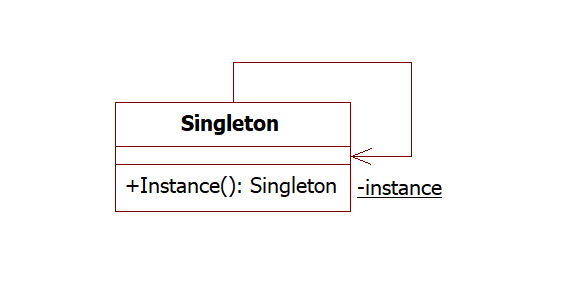
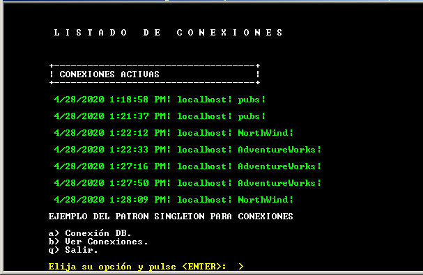
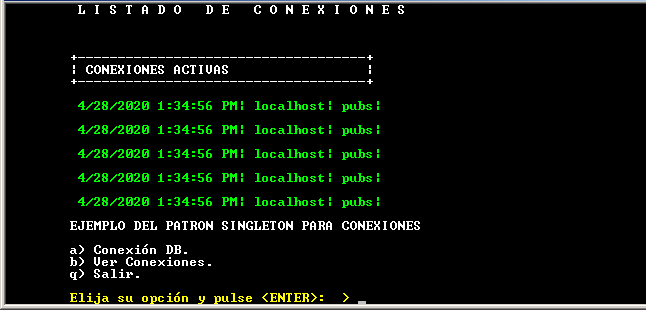

# El patrón singleton

Muchos problemas de rendimiento (performance) y de escalabilidad (scalability) ocurren si no manejamos correctamente las conexiones a las bases de datos, hay que tener en presente que las conexiones para acceder a una base de datos son un recurso que consume memoria y tiempo de procesador, por lo que solo se deben crear las conexiones necesarias para el funcionamiento de las aplicaciones y estas deben cerrarse tan pronto hayan sido ocupadas.
Una buena práctica es que todas las clases que acceden a los recursos de la base de datos utilicen siempre una única conexión sin importar el número de instancias que estas clases generen al ser ejecutadas dentro de una aplicación, una solución recomendada a este escenario es utilizar los patrones de diseño de software.

<h3>Conectarse a una base de datos con el patrón Singleton</h3>

Es un patrón de diseño del tipo creacional que nos asegura la creación de únicamente la instancia de un objeto sin importar el número de veces que se intenten crear más instancias de ese objeto.
citando el clásico libro de the gang of four Design Patterns:Elements of Reusable Object-Oriented Software, 1995, Pearson Addison Wesley "The Singleton design pattern must ensure a class only has one instance, and provide a global point of access to it"

Este patrón se utiliza para representar un objeto de hardware (por ejemplo una impresora), un componente del sistema operativo (un archivo o un directorio) o bien un recurso externo limitado (como una conexión a una base de datos), esta instancia revisará si ya ha sido creada, atenderá las peticiones de los objetos que la utilicen como un punto global de acceso (similar a una variable global) y sera responsable del mantener el seguimiento de su estado.

El esqueleto clásico de un Singleton es el siguiente:

A continuación voy a mostrar el ejemplo de una clase que representa una conexión a una base de datos sin utilizar el patrón Singleton, para mostrar como se crea una conexión por cada ocasión que nosotros llamamos a la clase lo cual repercute en la escalabilidad y el desempeño de la aplicación si se tuvieran que invocar decenas o cientos las ejecuciones a esta clase. Descarga el código del ejemplo sin utilizar Singleton de este enlace

Al compilar y ejecutar la aplicación se mostrará el siguiente menú.

Escogiendo la opción (a) nos mostrará el menú para solicitarnos los parámetros de la cadena de conexión, si repetimos este procedimiento nos mostrará
las conexiones hechas hacia el servidor, una por cada vez que hayamos completado la opción (a) como se muestra en la siguiente imagen.

Observamos en la imagen como es diferente el tiempo entre cada una de las conexiones ya que se crea una conexión por cada llamado.

Bien ahora mostraremos el mismo ejercicio utilizando el patrón Singleton en el código de la clase DataBase, pero para no sobrescribir la clase DataBase del ejercicio anterior, nombraremos la clase Singleton como DataBase2.

Si analizamos el patron Singleton vemos el uso de los modificadores private y static en el constructor hace que no se pueda crear la clase de forma directa, sino solo a traves del método public GetInstance(string conStr) que regresa la instancia creada y por ende sus propiedades y métodos públicos.
Ejecutando la aplicación, seleccionando la opción (a) para conectarse a una base de datos y creando varias conexiones debemos de ver la salida del programa como en la siguiente pantalla:

Observamos en la imagen previa como el tiempo y las propiedades entre cada una de las conexiones es siempre el mismo, ya que se crea una sola instancia global de acceso.

